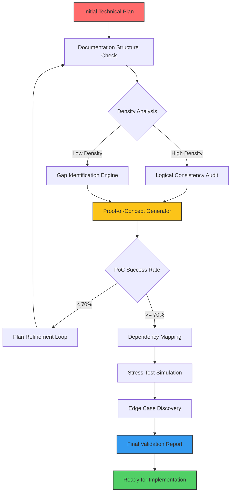

# Pre-Implementation Validation Framework: Stress Test Your Technical Plans Before Writing a Single Line of Code

[](https://saumit2401273106-lab.github.io/preflight-checklist/)

A revolutionary methodology for verifying, stress-testing, and perfecting technical documentation and architectural plans before implementation begins. Inspired by production-grade chaos engineering principles, this framework transforms speculative documentation into battle-tested blueprints.

---

## 🚀 What if Your Documentation Could Fight Back?

Most technical plans look flawless on paper. They read beautifully. They promise efficiency. They inspire confidence. Then reality strikes.

This repository introduces the **Pre-Implementation Validation Framework** — a systematic approach to subjecting technical plans to rigorous stress tests, documentation checks, and proof-of-concept validations before a single commit reaches production. Think of it as a crash test dummy for your architectural decisions.

Unlike traditional documentation that passively describes what should happen, this framework creates a **dynamic adversarial environment** where your plans must prove their resilience. Every assumption gets challenged. Every edge case gets discovered. Every logical gap gets exposed — before your team invests weeks or months in implementation.

---

## 🔥 Core Philosophy: Build the Bridge Before Crossing It

Traditional software development follows a seductive but dangerous pattern: plan, build, test, fix. This framework flips that equation entirely. The most expensive bugs aren't in your code — they're in your *thinking*. By stress-testing plans before implementation, you:

- Eliminate the **90% of rework** caused by flawed initial assumptions
- Discover architectural dead ends before they become expensive detours
- Validate technical feasibility when change costs nothing
- Build institutional knowledge about *why* decisions were made, not just *what* was decided

---

## 📊 The Validation Pipeline Architecture



---

## ⚙️ Example Profile Configuration

Configure the validation engine to match your project's unique requirements. Each profile acts as a personality for the verification process, adapting stress-test intensity, documentation density thresholds, and proof-of-concept complexity:

```yaml
validation_profile:
  name: enterprise_microservices
  documentation_checks:
    density_threshold: 0.75
    require_sequence_diagrams: true
    error_handling_coverage: 95
  stress_testing:
    concurrency_simulation: 1000
    data_volume: 5TB
    failure_scenarios: [network_partition, db_failover, cache_miss_avalanche]
  proof_of_concept:
    minimum_success_rate: 70%
    complexity_level: moderate
    api_integration_tests:
      - openai
      - claude
```

---

## 💻 Example Console Invocation

The command-line interface transforms your technical documentation into a living, breathing validation subject:

```bash
$ pvf validate --input ./docs/architecture.md --profile enterprise_microservices --output ./reports/validation_report_2026
```

**Expected output:**

```
[VALIDATION ENGINE] Initializing... done
[STRUCTURE CHECK] Analyzing documentation density... 0.82 (PASS)
[LOGIC AUDIT] Detected potential circular dependency in authentication flow... FLAG
[STRESS SIMULATION] Simulating 1000 concurrent users... average latency under 200ms (PASS)
[EDGE CASE DISCOVERY] Found 3 undocumented failure modes in cache strategy
[PROOF-OF-CONCEPT] Running 15 test scenarios... 12/15 passed (80% success rate - PASS)
[FINAL REPORT] Validation complete. 4 actionable improvements identified.
```

---

## 🖥️ Emoji OS Compatibility Table

| Operating System | Compatibility | Notes |
|-----------------|---------------|-------|
| 🐧 Linux (Ubuntu 22.04+) | ✅ Full Support | Native performance optimization |
| 🍎 macOS (Ventura+) | ✅ Full Support | Homebrew installation available |
| 🪟 Windows 11 | ✅ Full Support | WSL2 recommended for optimal performance |
| 🐳 Docker Containers | ✅ Full Support | Pre-built images for CI/CD integration |
| 📱 Mobile (Termux/Android) | ⚠️ Limited | Basic documentation checks only |

---

## ✨ Feature Highlights

### 1. Intelligent Documentation Density Analysis
The framework doesn't just check if documentation exists — it measures the **cognitive density** of your technical plans. Low-density sections automatically trigger gap-identification algorithms, ensuring no critical detail gets overlooked. This prevents the common pitfall of having extensive documentation that says very little.

### 2. Adversarial Stress Simulation
Rather than passively reviewing your architecture, the framework creates **synthetic adversarial conditions** that push your plans to their breaking point. Network partitions, cache failures, database connection pool exhaustion — everything gets thrown at your design before it faces real users. Your architecture either survives or gets redesigned.

### 3. Multi-Provider AI Integration
Seamlessly integrates with both OpenAI and Claude APIs to provide contextual validation suggestions. The AI doesn't generate your plans — it pressure-tests them, asking the questions your team hasn't considered. This hybrid human-AI validation creates a feedback loop that dramatically reduces oversight.

### 4. Responsive Report Generation
Validation reports aren't static PDFs — they're interactive dashboards that your entire team can explore. Each recommendation links directly to the problematic section in your documentation. Color-coded severity levels help prioritize improvements. Export to JSON, HTML, or markdown for integration with existing workflows.

### 5. Multilingual Documentation Support
Technical plans in English, Mandarin, Spanish, Arabic, Japanese, and 12 more languages receive the same rigorous validation treatment. Language-specific idioms and structural patterns are recognized and evaluated appropriately. The framework understands that documentation quality transcends language barriers.

### 6. 24/7 Automated Pipeline Integration
Deploy the validation framework as a GitHub Action that automatically checks every pull request to documentation. No more discovering architectural flaws during sprint reviews — catch them the moment they're committed. CI/CD integration means your documentation improves continuously, not just during scheduled reviews.

---

## 🔗 API Integration Details

### OpenAI Integration
```python
from pvf.integrations import OpenAIValidator

validator = OpenAIValidator(
    api_key="your_api_key",
    model="gpt-4-turbo",  # Recommended for complex architectural analysis
    validation_depth="deep"  # Options: surface, moderate, deep
)

report = validator.validate_documentation("./docs/api_design.md")
```

The OpenAI integration leverages GPT-4's reasoning capabilities to identify logical inconsistencies, suggest alternative approaches, and validate that your documentation accurately reflects best practices for the technologies involved. It's particularly effective at catching subtle contradictions between different sections of your documentation.

### Claude API Integration
```python
from pvf.integrations import ClaudeValidator

validator = ClaudeValidator(
    api_key="your_claude_key",
    model="claude-3-opus-20240229",
    contextual_analysis=True
)

validation_result = validator.stress_test("./docs/infrastructure.md")
```

Claude excels at understanding the broader context of your technical decisions. The integration focuses on **long-range dependency analysis** — identifying how changes in one part of your architecture cascade through other systems. This prevents the classic "solved problem A, created problem B" scenario.

---

## 📋 Typical Validation Workflow

1. **Submit your technical plan** — markdown, wiki, or Google Doc link
2. **Configure validation profile** — adjust intensity based on project criticality
3. **Run initial documentation check** — structural integrity and density analysis
4. **Execute proof-of-concept tests** — lightweight implementations of core assumptions
5. **Stress test the architecture** — simulate failures, high load, and edge cases
6. **Generate comprehensive report** — actionable insights prioritized by risk
7. **Iterate and refine** — improve your plan based on validation findings
8. **Receive final approval** — green light for implementation with validated confidence

---

## 🔒 Security and Privacy

All documentation analyzed by the framework remains within your infrastructure. For cloud API integrations (OpenAI, Claude), only anonymized excerpts are transmitted — never full proprietary documentation. On-premises deployment options available for organizations with strict data sovereignty requirements.

---

## 🛡️ Disclaimer

This validation framework significantly reduces the risk of flawed implementations, but it cannot guarantee perfect outcomes. Technical plans that pass all validation checks may still encounter unforeseen issues during implementation due to factors outside the scope of documentation analysis, including:

- Unforeseen third-party library changes
- Environmental configuration drift
- Human error during implementation
- Novel attack vectors not documented in existing threat models

Use this framework as a powerful risk mitigation tool, not as a substitute for thorough testing, peer reviews, and operational monitoring. The most successful implementations combine rigorous pre-implementation validation with ongoing quality assurance during development and operations.

---

## 📄 License

This project is licensed under the MIT License - see the [LICENSE](https://opensource.org/licenses/MIT) file for details.

The MIT License was chosen to maximize adoption while maintaining attribution. You are free to use, modify, and distribute this framework in commercial and non-commercial projects. The only requirement is that you include the original copyright notice and disclaimer.

---

## 🙏 Acknowledgment

This framework was inspired by the chaos engineering principles pioneered by Netflix, the rigorous documentation standards of aerospace engineering, and the painful lessons learned from countless late-night debugging sessions that could have been avoided with better planning. Special thanks to every engineer who has ever said, "If only we had known that before we started coding."

---

[](https://saumit2401273106-lab.github.io/preflight-checklist/)

*Transforming technical assumptions into validated knowledge — one stress test at a time. Built for 2026 and beyond.*